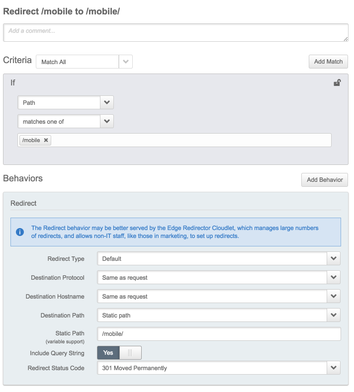

# Return an Edge permanent redirect (status code 301) from `/mobile` to `/mobile/`

# Use Case
Some Web Servers only return the default html file (usually index.html) when the URL ends in a slash. The code below automatically returns a permanent redirect for a specific URL (/mobile) which does not end with a slash with a counterpart URL ending in slash (/mobile/) so the default HTML can be displayed. You can edit the JSON code to replace "mobile" to whatever you need

# Installation instructions:

## Using the Property Manager User Interface
* Login to the Luna Control Center (Akamai Console) at https://control.akamai.com/ 
* Press the Context Selector Orange Button 

* Type the name of the property you want to modify and click on the hyperlink
* Click the gearbox icon on the "Actions" column of the version you want to build your configuration upon and click "Edit New Version"
* Click the "Add Rule" button, select "Blank Rule Template", give it a name and click "Insert Rule"
* Follow the screenshot below to define the rule

* Save the configuration and Activate in Staging
* Test the new functionality on the Staging network

## Using the [Property Manager API (PAPI)](https://developer.akamai.com/api/luna/papi/overview.html), and the [Akamai CLI](https://developer.akamai.com/cli)
* Using the [Akamai CLI](https://developer.akamai.com/cli) download the JSON representation of the property version you want to build your configuration upon. For example to download version 5 of a propery called jgarza-playground into a text file called jgarza-playground_v5.json you would run:
```
akamai property retrieve jgarza-playground --propver 5 > jgarza-playground.json
``` 
* Edit the file you just created, and insert the JSON code (./redirect-to-dir-with-slash.json) within the children [] array section. For example a configuration that doesn't have any rules will show in the JSON representation as:
```
"children": [],
```
After inserting the JSON code you would see something like:
```
"children": [
  {
    "name": "Redirect /mobile to /mobile/",
    ...
  }
],
```
* Create a new version of the property using the file you just edited
```
akamai property update jgarza-playground --file jgarza-playground.json
```
* You should see a new version being created similar to this:
```
... searching propertyName for jgarza-playground
... getting info for prp_433861
Updating jgarza-playground
... copy property (jgarza-playground) v5
Retrieving jgarza-playground v6
... retrieving property (jgarza-playground) v6
... updating property (jgarza-playground) v6
Command time: 0.13 mins
``` 
* Activate the new version in Staging. You should see something similar to this:
```
akamai property --section au-web-perf activate jgarza-playground --propver 6 --network staging
... searching propertyName for jgarza-playground
... getting info for prp_433861
Activating jgarza-playground to STAGING
... activating property (jgarza-playground) v6 on STAGING
... automatically acknowledging 1 warnings!
Warnings: This property is using `latest` rule format, which is designed to reflect interface changes immediately. We suggest converting the property to a stable rule format such as `v2018-02-27` to minimize the risk of interface changes breaking your API client program.
... activating property (jgarza-playground) v6 on STAGING
... waiting 30s
... waiting 30s
... waiting 30s
... waiting 30s
... waiting 30s
Command time: 2.9 mins
```
* Test the new functionality on the Staging network
